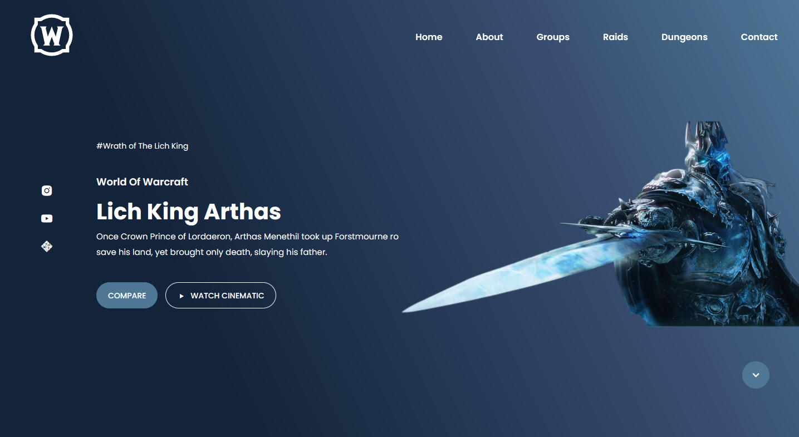

# Responsive Gaming Website
## [Watch it on youtube](https://youtu.be/90xFIg6VeQY)
### Responsive Gaming Website

- Responsive Gaming Website Design Using HTML CSS & JavaScript
- Developed first with the Mobile First methodology, then for desktop.
- Compatible with all mobile devices and with a beautiful and pleasant user interface.

💙 Join the channel to see more videos like this. [NaeuCode](https://www.youtube.com/@Naeucode)

